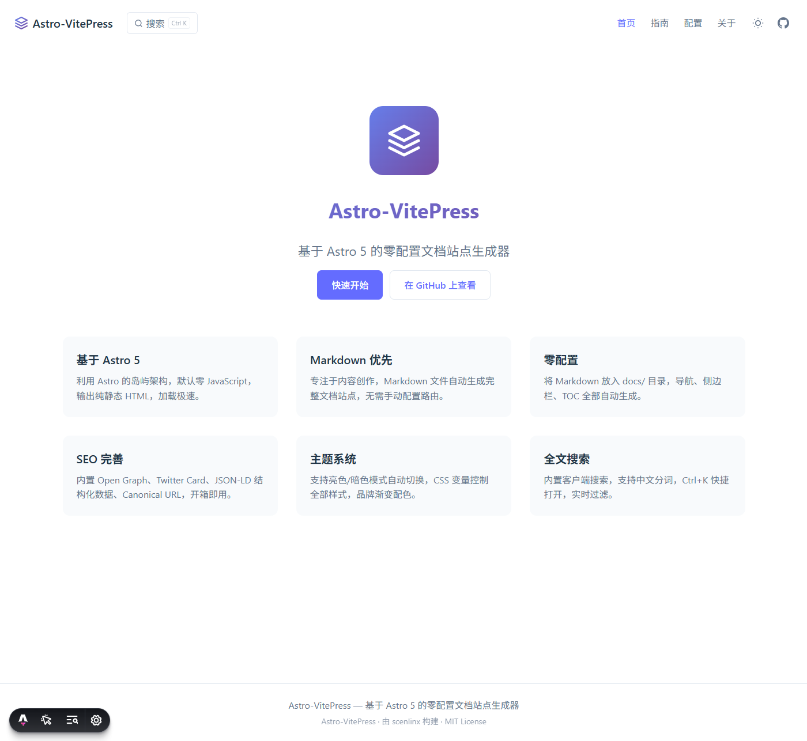

<p align="center">
  
</p>

<h1 align="center">Astro-VitePress</h1>

<p align="center">
  <strong>基于 Astro 5 的零配置文档站点生成器，Markdown 驱动，极速加载</strong>
</p>

<p align="center">
  <a href="https://docs.panws.top"><strong>在线演示 →</strong></a>
  ·
  <a href="#快速开始"><strong>快速开始</strong></a>
  ·
  <a href="https://github.com/scenlinx/astro-vitepress"><strong>GitHub</strong></a>
</p>

<p align="center">
  
  
  
  
</p>

---

<p align="center">
  
</p>

## 特性

- **基于 Astro 5** — 岛屿架构，默认零 JavaScript，输出纯静态 HTML
- **Markdown 驱动** — 只需编写 `.md` 文件，自动生成完整文档站点
- **零配置** — 将 Markdown 放入 `docs/` 目录，导航、侧边栏、TOC 全部自动生成
- **SEO 完善** — 内置 Open Graph、Twitter Card、JSON-LD（Article + BreadcrumbList）
- **主题系统** — 支持亮色/暗色模式自动切换，CSS 变量控制全部样式
- **响应式设计** — 桌面端三栏布局 + 移动端抽屉式导航
- **全文搜索** — 内置客户端搜索，Ctrl+K 快捷打开，实时过滤
- **自动目录** — 基于 h2/h3 标题自动生成右侧 TOC，滚动跟随高亮
- **前后导航** — 自动生成上一篇/下一篇文档链接
- **代码块复制** — 鼠标悬停代码块显示复制按钮，一键复制
- **自定义 404** — 内置品牌风格 404 页面
- **零依赖** — 仅依赖 Astro，无额外运行时库

## 项目结构

```
astro-vitepress/
├── docs/                    # 文档目录（放置 .md 文件）
│   ├── index.md             #   首页（Hero + Features）
│   ├── about.md             #   关于页面
│   ├── guide/               #   指南板块
│   │   ├── quickstart.md
│   │   └── advanced.md
│   └── config/              #   配置板块
│       ├── basics.md
│       └── theming.md
├── src/
│   ├── components/          # 组件
│   │   ├── SEOMeta.astro    #   SEO 元标签（OG/Twitter/JSON-LD）
│   │   ├── SearchModal.astro#   搜索弹窗
│   │   ├── NavDrawer.astro  #   移动端导航抽屉
│   │   └── ...
│   ├── config/              # 配置
│   │   ├── site.ts          #   导航与站点配置
│   │   └── docs.ts          #   文档加载与路由逻辑
│   ├── layouts/             # 布局
│   │   ├── HomeLayout.astro #   首页布局
│   │   └── MainLayout.astro #   文档页布局
│   ├── pages/               # 页面路由
│   │   ├── index.astro      #   首页
│   │   ├── [...slug].astro  #   动态文档路由
│   │   └── 404.astro        #   自定义 404
│   └── styles/
│       └── global.css       #   全局样式（CSS 变量 + 主题）
├── public/                  # 静态资源
│   ├── favicon.svg
│   ├── og-image.svg
│   ├── apple-touch-icon.svg
│   ├── hero-logo.svg
│   └── nav-logo.svg
├── astro.config.mjs         # Astro 配置
├── vercel.json              # Vercel 部署配置
├── netlify.toml             # Netlify 部署配置
└── package.json
```

## 快速开始

### 前置要求

- **Node.js** ≥ 18.0
- **npm** 或 **pnpm**

### 安装运行

```bash
git clone https://github.com/scenlinx/astro-vitepress.git
cd astro-vitepress
npm install
npm run dev
```

### 编写文档

在 `docs/` 目录下创建 `.md` 文件，添加 Frontmatter：

```yaml
---
title: 我的文档
description: 文档描述
keywords: 关键词
date: 2026-06-02
order: 1
---
```

### 配置导航

编辑 `src/config/site.ts`：

```ts
export const navConfig: NavItem[] = [
  { type: 'page', id: '/', text: '首页' },
  { type: 'folder', id: 'guide', text: '指南' },
  { type: 'page', id: 'about', text: '关于' },
];
```

- `type: 'folder'` — 文件夹导航，自动链接到该目录下 order 最小的页面
- `type: 'page'` — 独立页面导航

### 首页配置

编辑 `docs/index.md` 的 Frontmatter：

```yaml
heroTitle: 我的项目
heroDesc: 一句话描述你的项目
primaryAction: 快速开始
primaryActionLink: /guide/quickstart
secondaryAction: GitHub
secondaryActionLink: https://github.com/your/repo
features:
  - title: 特性一
    desc: 特性描述
  - title: 特性二
    desc: 特性描述
```

### 部署

```bash
npm run build
```

`dist/` 目录即为完整的静态站点，可部署到任意静态托管服务。

项目已内置 **Vercel** 和 **Netlify** 的部署配置文件，零配置一键部署。

## 主题定制

所有样式通过 CSS 变量控制（`src/styles/global.css`）：

```css
:root {
  --primary-color: #646cff;
  --bg-color: #ffffff;
  --sidebar-bg: #f8fafc;
  --text-color: #213547;
}

.dark {
  --bg-color: #11151c;
  --sidebar-bg: #0d101a;
  --text-color: #e2e8f0;
}
```

默认使用紫色渐变 `#667eea → #764ba2`，可修改 `--gradient-brand` 变量。

## SEO 能力

每个页面自动注入完整的 SEO 元标签：

| 功能 | 说明 |
|------|------|
| Meta Tags | `description`、`keywords`、`author` |
| Open Graph | `og:title`、`og:description`、`og:image`、`og:type`、`og:url` |
| Twitter Card | `summary_large_image` 卡片 |
| JSON-LD | WebSite / Article + BreadcrumbList 结构化数据 |
| Canonical | 规范链接，避免重复内容 |
| Sitemap | 自动生成 XML Sitemap，按层级分配优先级 |

## 脚本

| 命令 | 说明 |
|------|------|
| `npm run dev` | 启动开发服务器（自动打开浏览器） |
| `npm run build` | 构建生产版本到 `dist/` |
| `npm run preview` | 本地预览生产构建 |
| `npm run lint` | TypeScript 类型检查 |

## 许可证

[MIT License](LICENSE) © scenlinx
